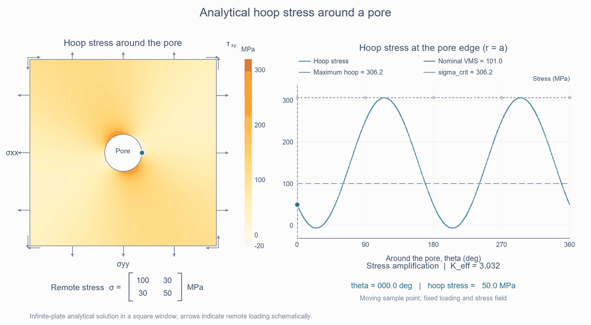

# Analytical Stress Concentration Around a Pore

Two simple MATLAB examples demonstrating stress concentration around a circular pore using Kirsch's analytical solution.

The motivation is to evaluate local stress amplification efficiently, for example, around porosity defects in metal additive manufacturing, such as laser powder bed fusion (LPBF).

## 1. Compare different loading conditions

**File:** `pore_SCF.m`

This script considers five loading conditions:

- Uniaxial tension
- Uniaxial compression
- Pure shear
- Combined tension and shear
- Combined compression and shear

For each case, it calculates the hoop stress along the pore boundary and identifies its maximum.

The maximum hoop stress is compared with the nominal von Mises stress calculated from the remote stress components. A smooth maximum selects approximately the larger of these two values as the augmented stress, `sigma_crit`.

The effective amplification factor, `K_eff`, is the augmented stress divided by the nominal von Mises stress.

The script displays stress curves, comparison charts, and a results table.

## 2. Visualize stress around the pore

**File:** `visualization.m`

This example uses the following remote stress components:

- Normal stress in the x-direction: 100 MPa
- Normal stress in the y-direction: 50 MPa
- Shear stress: 30 MPa

The left panel shows the analytical hoop stress distribution around the pore. The right panel shows the hoop stress along its boundary.

The nominal von Mises stress is included as a reference for comparison.

## How to run

Download the MATLAB files and open their folder in MATLAB.

Run `pore_SCF` to compare loading conditions, or `visualization` to display the stress field around the pore.

To explore other loads, edit `s` in the first script or `sx`, `sy`, and `txy` in the second script.

## About the stress measure

The augmented stress retains the nominal von Mises stress as a lower bound. Additional amplification is applied when the maximum hoop stress exceeds this reference.

This measure represents tensile-side stress amplification, not the maximum local von Mises stress around the pore.

## Assumptions

The analytical model assumes an infinite, linearly elastic plate under plane stress with an isolated, small, traction-free circular pore.

The square shown in the visualization is a viewing window into the infinite-plate solution, not a finite plate boundary.

## References

1. Kirsch, E. G. (1898). *Die Theorie der Elastizität und die Bedürfnisse der Festigkeitslehre.*
2. *Reliability-based topology optimization considering stochastic porosity defects in additive manufacturing.* Structural and Multidisciplinary Optimization, accepted. This paper provides further details on the analytical approach for evaluating pore-induced stress amplification.
