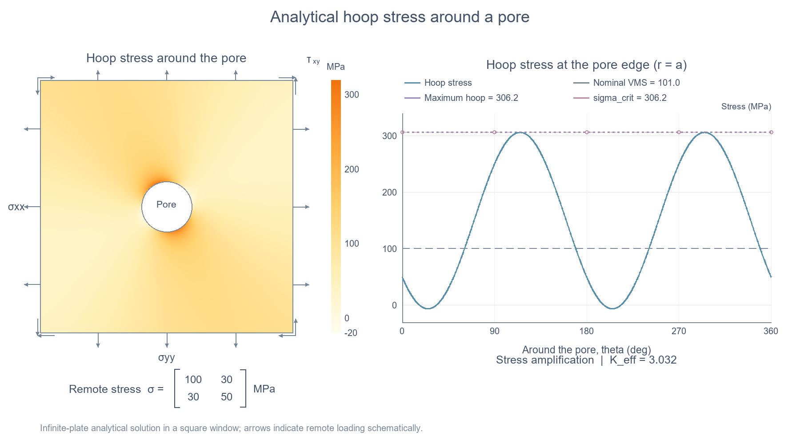

````markdown
# Analytical Stress Concentration Around a Pore

Two simple MATLAB examples demonstrating stress concentration around a circular pore using Kirsch's analytical solution.

The motivation is to evaluate local stress amplification efficiently, for example, around porosity defects in metal additive manufacturing, such as laser powder bed fusion (LPBF).

## 1. Compare different loading conditions

**File:** `pore_SCF.m`

This script considers five loading conditions:

- Uniaxial tension
- Uniaxial compression
- Pure shear
- Combined tension and shear
- Combined compression and shear

For each case, it calculates the hoop stress along the pore boundary and compares it with the nominal von Mises stress.

To retain the nominal von Mises stress as a lower bound, the augmented stress is computed using a smooth maximum:

$$
\sigma_{\mathrm{crit}}
=
S_{\varepsilon}
\left(\sigma_{\theta\theta}^{\max},\sigma_{\mathrm{vm,nom}}\right).
$$

The effective amplification factor is then calculated as:

$$
K_{\mathrm{eff}}
=
\frac{\sigma_{\mathrm{crit}}}{\sigma_{\mathrm{vm,nom}}}.
$$

The script displays stress curves, comparison charts, and a results table.

## 2. Visualize stress around the pore

**File:** `visualization.m`

As an example, the following 2D remote stress tensor is used:

$$
\boldsymbol{\sigma}^{\infty}
=
\begin{bmatrix}
100 & 30 \\
30 & 50
\end{bmatrix}
\ \mathrm{MPa}.
$$

The left panel shows the analytical hoop stress distribution around the pore. The right panel shows the hoop stress along its boundary.

The nominal von Mises stress is included as a reference for comparison.



## How to run

Download the MATLAB files and open their folder in MATLAB.

Run either script:

```matlab
pore_SCF
```

or:

```matlab
visualization
```

To explore other loads, edit `s` in the first script or `sx`, `sy`, and `txy` in the second script.

## About the stress measure

The augmented stress approximates the larger of:

- The maximum hoop stress along the pore boundary.
- The nominal von Mises stress.

A smooth maximum is used in the code. This measure represents tensile-side stress amplification, not the maximum local von Mises stress around the pore.

## Assumptions

The analytical model assumes an infinite, linearly elastic plate under plane stress with an isolated, small, traction-free circular pore.

## References

1. Kirsch, E. G. (1898). *Die Theorie der Elastizität und die Bedürfnisse der Festigkeitslehre.*
2. *Reliability-based topology optimization considering stochastic porosity defects in additive manufacturing.* Structural and Multidisciplinary Optimization, accepted. This paper provides further details on the analytical approach for evaluating pore-induced stress amplification.
````
